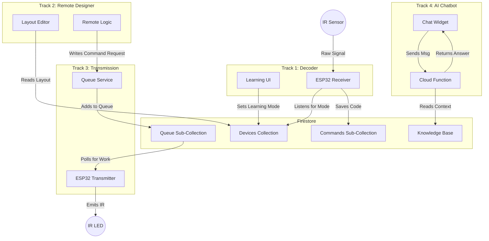
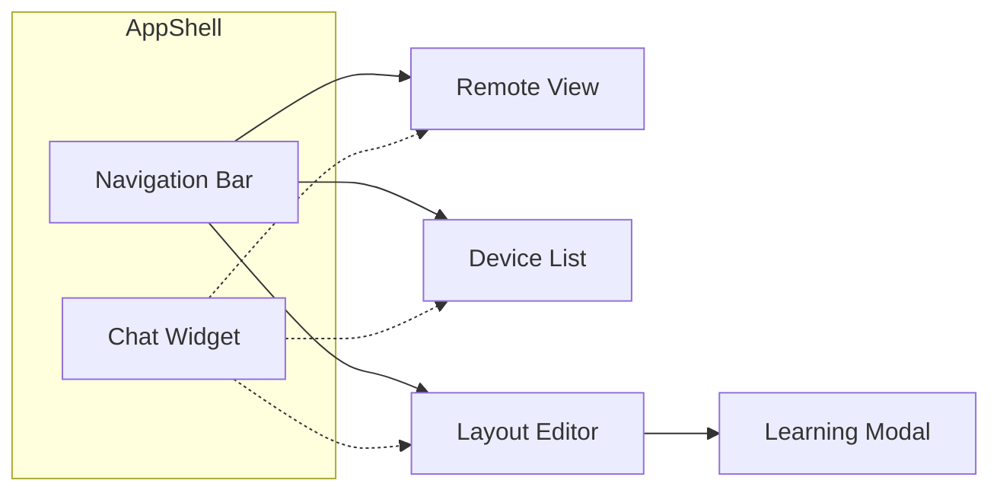

# Pulsr — System Architecture

**Goal:** Visualize how the four distinct implementation tracks interact to form the complete Pulsr system.

## System Architecture

The system revolves around **Firebase** as the central message bus. The Web App and ESP32 never communicate directly; they synchronize state via Firestore.



## Integration Points

1.  **Designer ↔ Transmission**:
    *   The **Designer** (Track 2) creates the buttons.
    *   When clicked, these buttons trigger the **Transmission** logic (Track 3) by referencing the `CommandID` stored by the **Decoder** (Track 1).

2.  **Decoder ↔ Designer**:
    *   The **Decoder** (Track 1) populates the database with available commands.
    *   The **Designer** (Track 2) reads this list so users can assign "Volume Up" to a button.

3.  **Chatbot ↔ System**:
    *   The **Chatbot** (Track 4) is an independent overlay but reads the `KnowledgeBase` which documents the system's hardware and software behavior.

## Data Flow Summary

| Action | Track Needed | Flow |
| :--- | :--- | :--- |
| **User Creates Remote** | Track 2 (Designer) | UI Creates Layout → Save to DB |
| **User Teaches Remote** | Track 1 (Decoder) | UI Sets Mode → ESP Reads IR → Save to DB |
| **User Presses Button** | Track 3 (Transmission) | UI Writes to Queue → ESP Reads Queue → ESP Blinks LED |
| **User Asks Help** | Track 4 (Chatbot) | UI calls Cloud Function → AI Answers |

## Navigation Structure

The web app uses a **bottom tab bar** (mobile) / **sidebar** (desktop) for primary navigation.

| Route | Screen | Track |
|-------|--------|-------|
| `/` | Remote Control | Transmission |
| `/devices` | Device List | Designer |
| `/designer/:id` | Layout Editor | Designer |
| `/designer/:id/learn` | Learning Modal | Decoder |

The **Chatbot Widget** is a floating button available on all screens.



## Design Principles

This project follows **Loose Coupling** and **Test-Driven Development (TDD)** principles where appropriate.

### Loose Coupling

All major subsystems communicate through well-defined interfaces rather than concrete implementations. This enables:

- **Testability**: Mock implementations can replace real services (Firestore, IR hardware, AI providers) in tests
- **Flexibility**: Swap providers (e.g., OpenAI → Anthropic) without rewriting business logic
- **Parallel Development**: Teams can work on different tracks independently using interface contracts

**Key Abstractions:**

| Interface | Purpose | Implementations |
|-----------|---------|-----------------|
| `ICommandRepository` | Command storage | `FirestoreCommandRepository`, `InMemoryCommandRepository` |
| `ICommandQueue` | Transmission queue | `FirestoreQueue`, `InMemoryQueue` |
| `IProtocolDecoder` | IR signal decoding | `NECDecoder`, `SonyDecoder`, `SamsungDecoder` |
| `IProtocolEncoder` | IR signal encoding | `NECEncoder`, `SonyEncoder`, `SamsungEncoder` |
| `ISignalCapture` | Hardware IR input | `ESP32SignalCapture`, `MockSignalCapture` |
| `IIRTransmitter` | Hardware IR output | `ESP32Transmitter`, `MockTransmitter` |
| `IAIProvider` | AI chat completions | `OpenAIProvider`, `AnthropicProvider`, `MockAIProvider` |
| `IKnowledgeRetriever` | RAG context lookup | `FirestoreKnowledgeRetriever`, `StaticKnowledgeRetriever` |

### Test-Driven Development

TDD is applied **selectively** based on testability:

| Track | TDD Applicability | Rationale |
|-------|-------------------|-----------|
| **Decoder** | Very High | Protocol decoders have deterministic I/O—ideal for test-first design |
| **Transmission** | High | Queue logic, FIFO ordering, and retry behavior are pure functions |
| **Chatbot** | High | Prompt construction and session management are testable without API calls |
| **Designer** | Low-Medium | Data layer (validation, persistence) suits TDD; UI interactions require manual/E2E testing |

**TDD Workflow:**
1. Write a failing test that defines expected behavior
2. Implement minimal code to pass the test
3. Refactor while keeping tests green
4. Repeat for next behavior

## Project Structure

This project uses a **platform-based organization** where documentation lives with the code it describes:

```
docs/
└── ARCHITECTURE.md         # This file - system overview

esp32/
├── decoder/
│   ├── plan.md             # Design, Firestore schema, task list
│   └── progress.md         # Implementation checklist
├── transmission/
│   ├── plan.md
│   └── progress.md
├── src/
│   ├── main.cpp            # Production firmware
│   ├── decoder/            # Learning mode implementations
│   ├── transmission/       # Queue processing implementations
│   ├── shared/             # Cross-cutting (LED, state machine)
│   └── hardware_tests/     # Standalone test scripts
├── include/
│   ├── decoder/            # ISignalCapture, IProtocolDecoder
│   ├── transmission/       # IIRTransmitter
│   └── shared/             # IStatusIndicator
└── platformio.ini

web/
└── features/
    ├── decoder/
    │   ├── plan.md         # Design, Firestore schema, task list
    │   └── progress.md     # Implementation checklist
    ├── transmission/
    │   ├── plan.md
    │   └── progress.md
    ├── designer/
    │   ├── plan.md
    │   └── progress.md
    └── chatbot/
        ├── plan.md
        └── progress.md
```

### Organization Rationale

**Platform-Based:** Each platform (ESP32, Web) has self-contained docs for each feature.

**Parallel Work:** Teams can work on ESP32 decoder and Web decoder independently - each has their own plan and progress tracking.

**plan.md Contains:**
- Feature requirements
- Firestore schema (duplicated where needed)
- Implementation design
- Task list

**progress.md Contains:**
- Checkboxes for completed tasks
- Current blockers
- Next steps
