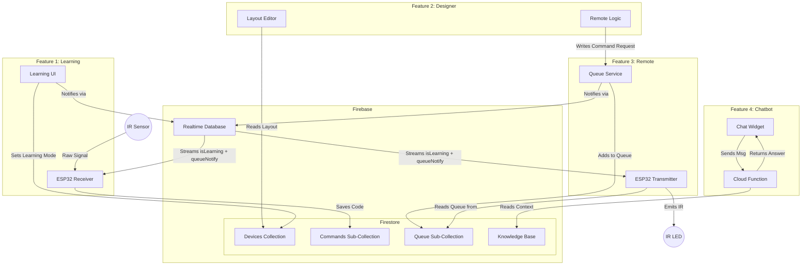
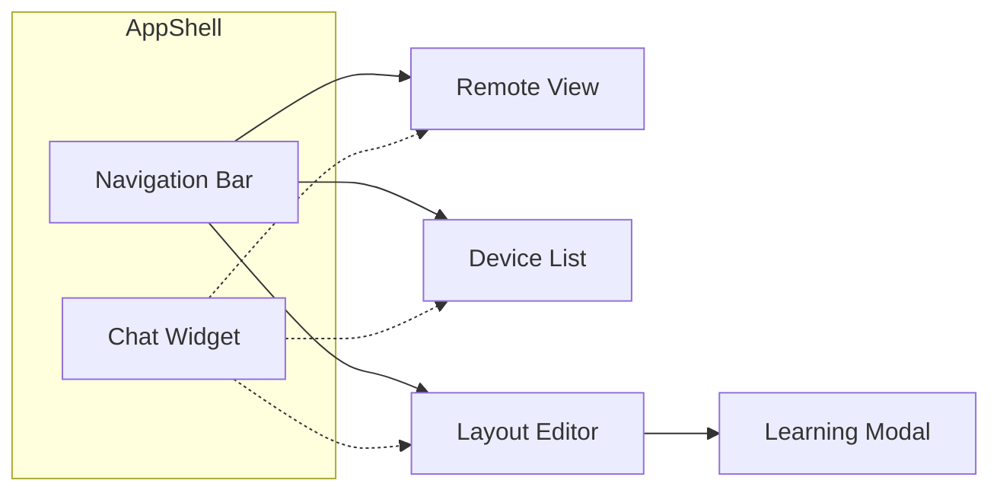

# Pulsr — System Architecture

**Goal:** Visualize how the four distinct features interact to form the complete Pulsr system.

## System Architecture

The system revolves around **Firebase** as the central message bus. The Web App and ESP32 never communicate directly; they synchronize state through two Firebase services:

- **Firestore** — structured data storage (commands, layouts, device metadata, queue items)
- **Realtime Database (RTDB)** — lightweight push notifications to the ESP32 via persistent streaming

**Important:** The ESP32 device does **NOT** serve the web application. The React web app is hosted on **Firebase Hosting** as static files. The ESP32's sole responsibility is IR signal processing (receiving and transmitting). All web UI ↔ ESP32 communication happens asynchronously through Firebase.



## Integration Points

1.  **Designer ↔ Remote**:
    *   The **Designer** creates the buttons.
    *   When clicked, these buttons trigger the **Remote** logic by referencing the `CommandID` stored by the **Learning** feature.

2.  **Learning ↔ Designer**:
    *   The **Learning** feature populates the database with available commands.
    *   The **Designer** reads this list so users can assign "Volume Up" to a button.

3.  **Chatbot ↔ System**:
    *   The **Chatbot** is an independent overlay but reads the `KnowledgeBase` which documents the system's hardware and software behavior.

## Data Flow Summary

| Action | Feature | Flow |
| :--- | :--- | :--- |
| **User Creates Remote** | Designer | UI creates layout → saves to Firestore |
| **User Teaches Command** | Learning | UI sets `isLearning` in Firestore + RTDB → RTDB pushes to ESP32 → ESP32 captures IR → saves command to Firestore |
| **User Presses Button** | Remote | UI adds queue item to Firestore + bumps `queueNotify` in RTDB → RTDB pushes to ESP32 → ESP32 reads queue from Firestore → emits IR |
| **User Asks Help** | Chatbot | UI calls Cloud Function → AI answers |

## ESP32 ↔ Firebase Communication Strategy

The ESP32 uses a **hybrid Firestore + RTDB** architecture. RTDB provides instant push notifications via Server-Sent Events (SSE); Firestore stores structured data. This replaced an earlier polling design that exceeded the Firestore free tier:

| Approach | Firestore Reads/Day | Latency | Free Tier Impact |
|----------|---------------------|---------|------------------|
| Polling (2s) × 2 paths | ~86,400 | Up to 2s | **Over 50k limit** |
| **RTDB streaming + on-demand Firestore reads** | ~Handful per actual event | ~100ms | **Negligible** |

### How it works

The ESP32 opens a single persistent SSE connection to RTDB path `/devices/{deviceId}`. This stream delivers two signals:

- **`isLearning`** (boolean) — set by the web UI when the user enters learning mode
- **`queueNotify`** (timestamp) — bumped by the web UI when a new command is enqueued

When the stream fires, the ESP32 main loop processes the event:
- `isLearning` change → starts or stops the `LearningStateMachine`
- `queueNotify` change → triggers `QueueProcessor` to read pending items from Firestore once

### Why two databases?

| Database | Role | What's stored |
|----------|------|---------------|
| **RTDB** | Real-time push channel | `isLearning`, `queueNotify` (tiny flags per device) |
| **Firestore** | Structured data store | Commands, layouts, queue items, device metadata |

The web app writes to **both** on every user action that the ESP32 needs to react to. Firestore remains the source of truth; RTDB is a lightweight notification bell.

## Navigation Structure

The web app uses a **bottom tab bar** (mobile) / **sidebar** (desktop) for primary navigation.

| Route | Screen | Feature |
|-------|--------|-------|
| `/` | Remote Control | Remote |
| `/learn` | Learn Commands | Learning |
| `/designer` | Layout Designer | Designer |
| `/remote` | Remote Control | Remote |

The **Chatbot Widget** is a floating button available on all screens.



## Design Principles

This project follows **Loose Coupling** and **Test-Driven Development (TDD)** principles where appropriate.

### Loose Coupling

All major subsystems communicate through well-defined interfaces rather than concrete implementations. This enables:

- **Testability**: Mock implementations can replace real services (Firestore, IR hardware, AI providers) in tests
- **Flexibility**: Swap providers (e.g., OpenAI → Anthropic) without rewriting business logic
- **Parallel Development**: Teams can work on different tracks independently using interface contracts

**Key Abstractions:**

| Interface | Purpose | Implementations |
|-----------|---------|-----------------|
| `ICommandRepository` | Command storage | `FirestoreCommandRepository`, `InMemoryCommandRepository` |
| `ICommandQueue` | Transmission queue | `FirestoreQueue`, `InMemoryQueue` |
| `IProtocolDecoder` | IR signal decoding | `NECDecoder`, `SonyDecoder`, `SamsungDecoder` |
| `IProtocolEncoder` | IR signal encoding | `NECEncoder`, `SonyEncoder`, `SamsungEncoder` |
| `ISignalCapture` | Hardware IR input | `ESP32SignalCapture`, `MockSignalCapture` |
| `IIRTransmitter` | Hardware IR output | `ESP32Transmitter`, `MockTransmitter` |
| `IAIProvider` | AI chat completions | `OpenAIProvider`, `AnthropicProvider`, `MockAIProvider` |
| `IKnowledgeRetriever` | RAG context lookup | `FirestoreKnowledgeRetriever`, `StaticKnowledgeRetriever` |

### Test-Driven Development

TDD is applied **selectively** based on testability:

| Track | TDD Applicability | Rationale |
|-------|-------------------|-----------|
| **Decoder** | Very High | Protocol decoders have deterministic I/O—ideal for test-first design |
| **Transmission** | High | Queue logic, FIFO ordering, and retry behavior are pure functions |
| **Chatbot** | High | Prompt construction and session management are testable without API calls |
| **Designer** | Low-Medium | Data layer (validation, persistence) suits TDD; UI interactions require manual/E2E testing |

**TDD Workflow:**
1. Write a failing test that defines expected behavior
2. Implement minimal code to pass the test
3. Refactor while keeping tests green
4. Repeat for next behavior

## Project Structure

This project uses a **platform-based organization** where documentation lives with the code it describes:

```
docs/
└── ARCHITECTURE.md         # This file - system overview

esp32/
├── receiver/
│   ├── plan.md             # Design, Firestore schema, task list
│   └── progress.md         # Implementation checklist
├── transmitter/
│   ├── plan.md
│   └── progress.md
├── src/
│   ├── main.cpp            # Production firmware
│   ├── receiver/            # Learning mode implementations
│   ├── transmitter/       # Queue processing implementations
│   ├── utils/              # Utilities (LED, WiFi, etc.)
│   └── hardware_tests/     # Standalone test scripts
├── include/
│   ├── receiver/            # ISignalCapture, IProtocolDecoder
│   ├── transmitter/       # IIRTransmitter
│   └── utils/              # IStatusIndicator
└── platformio.ini

web/
├── ARCHITECTURE.md         # Web app tech stack and patterns
├── PROJECT_STRUCTURE.md    # Detailed file organization
├── package.json            # Dependencies
├── src/
│   └── features/
│       ├── decoder/
│       │   ├── plan.md         # Design, Firestore schema, task list
│       │   ├── progress.md     # Implementation checklist
│       │   ├── components/
│       │   ├── hooks/
│       │   ├── repositories/
│       │   └── __tests__/
│       ├── transmission/
│       │   ├── plan.md
│       │   ├── progress.md
│       │   └── ... (same structure)
│       ├── designer/
│       │   ├── plan.md
│       │   ├── progress.md
│       │   └── ... (same structure)
│       ├── chatbot/
│       │   ├── plan.md
│       │   ├── progress.md
│       │   └── ... (same structure)
│       └── core/
│           ├── firebase/
│           ├── ui/
│           ├── navigation/
│           └── types/
└── tests/
    └── e2e/
```

### Organization Rationale

**Platform-Based:** Each platform (ESP32, Web) has self-contained docs for each feature.

**Parallel Work:** Teams (or agents) can work on ESP32 decoder and Web decoder independently - each has their own plan and progress tracking.

**plan.md Contains:**
- Feature requirements
- Firestore schema (duplicated where needed)
- Implementation design
- Task list

**progress.md Contains:**
- Checkboxes for completed tasks
- Current blockers
- Next steps
