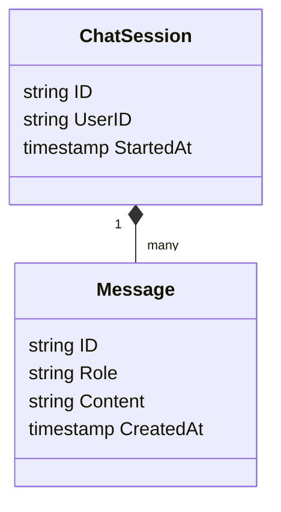
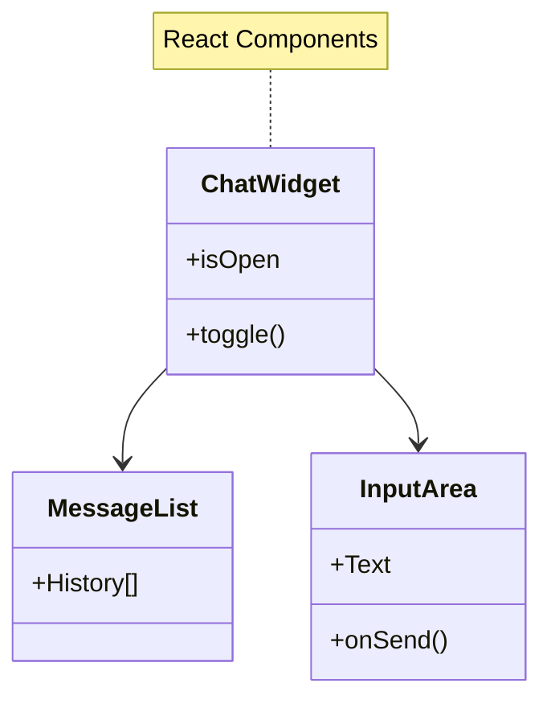
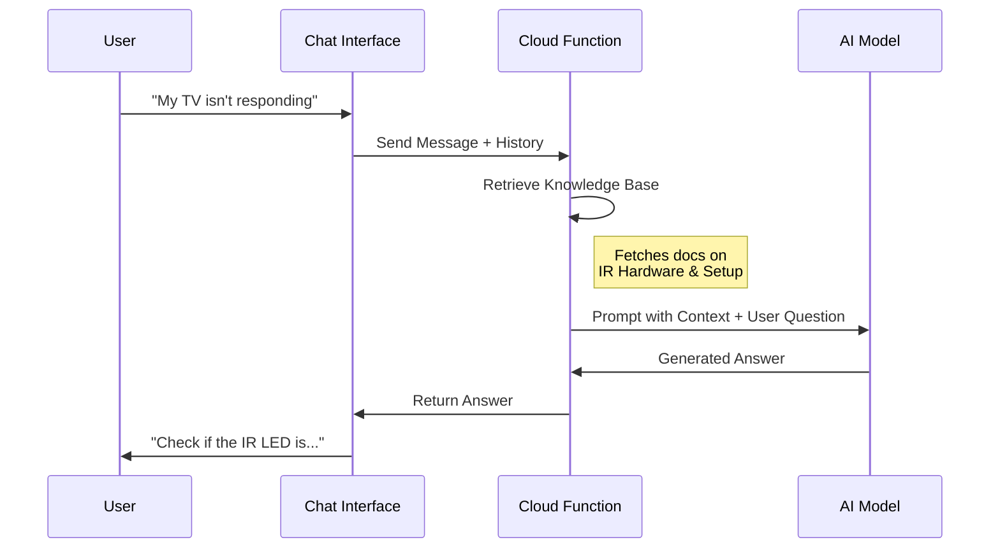

# Plan: AI Chatbot Assistant

**Goal:** An intelligent assistant that provides instant troubleshooting and technical support, leveraging the project's documentation and knowledge base.

## Functional Requirements

1.  **Context-Aware Support**: The AI should know about the specific hardware (ESP32) and common IR issues (line-of-sight, frequency mismatch) to give relevant advice.
2.  **Troubleshooting Guide**: It should guide users through step-by-step debugging (e.g., "Is the blue LED flashing?").
3.  **Seamless Integration**: The chat should be available directly within the app as a floating widget, not a separate page.
4.  **Secure Access**: API keys for the AI provider must remain secure and never exposed to the client browser.

## Data Model

### Frontend Architecture

## Interaction Flow

## Technical Strategy

-   **Retrieval-Augmented Generation (RAG)**: We will store "Expert Knowledge" (wiring diagrams text, troubleshooting steps, FAQ) in the database. When a user asks a question, we will inject this relevant context into the AI prompt.
-   **Server-Side Execution**: All AI processing happens in a serverless function. This keeps our secrets safe and allows us to rate-limit users if necessary.
-   **Session History**: The chat will maintain a short history of the current conversation so the AI remembers previous context (e.g., "It still didn't work" refers to the previous suggestion).

## Design Principles

### Loose Coupling

- **AI Provider Abstraction (`IAIProvider`)**: Defines `complete(prompt, context): string` method. Allows swapping providers (OpenAI, Anthropic, local models) without changing backend logic.
- **Knowledge Base Service (`IKnowledgeRetriever`)**: Decouples RAG retrieval into a separate service. The chat handler receives knowledge via dependency injection, not direct database queries.
- **Message Transport Interface**: Abstracts message delivery so chat can work over WebSockets, HTTP polling, or Server-Sent Events without rewriting core logic.
- **Session Storage (`ISessionStore`)**: Interface for session persistence rather than direct Firestore coupling. Enables Redis or in-memory stores for testing.

### TDD Approach

**Unit Tests (write first):**
- Test prompt construction with mocked knowledge base context
- Test session history truncation logic (respects token limits)
- Test message sanitization (XSS prevention, input validation)

**Integration Tests:**
- Test full chat flow with mock AI provider returning deterministic responses
- Test knowledge retrieval returns relevant documents for sample queries

**Contract Tests:**
- Verify `IAIProvider` interface contract is satisfied by each implementation

## Verification

-   **Safety Test**: Ensure the AI declines to answer irrelevant questions (e.g., "Write me a poem").
-   **Knowledge Test**: Ask specific technical questions about the project wiring to ensure it uses the provided knowledge base and not generic internet info.
