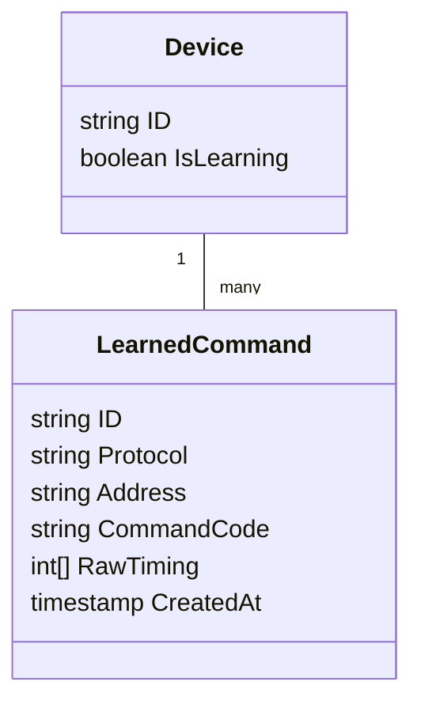
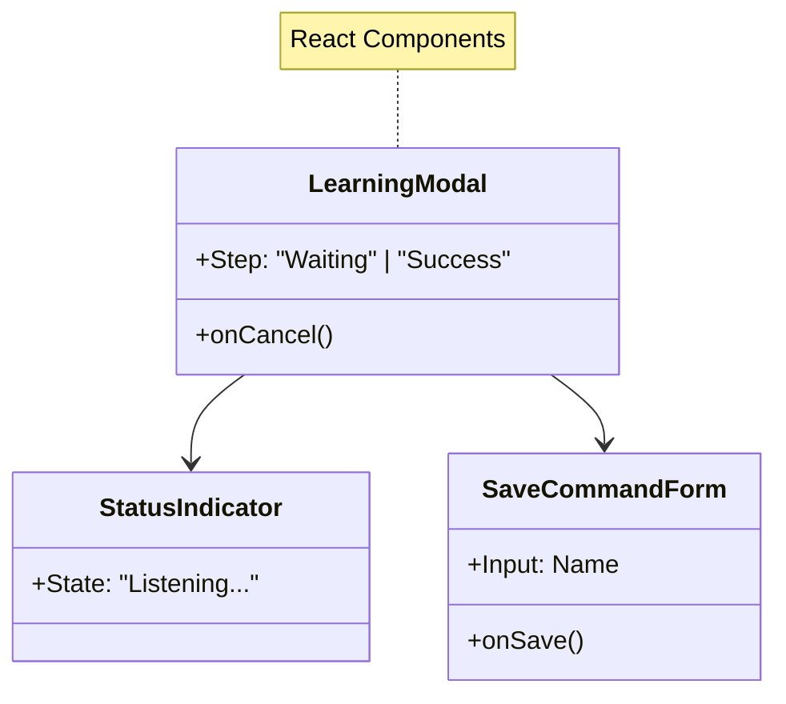
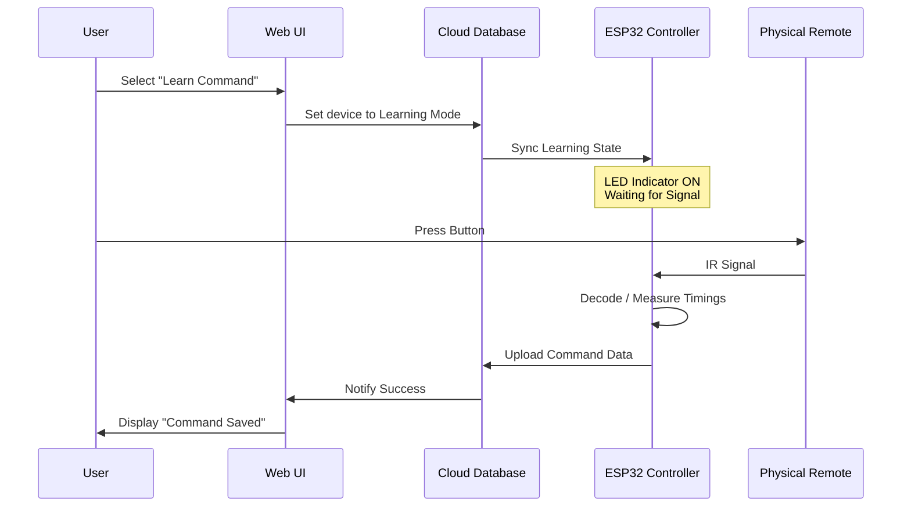

# Plan: IR Decoder (Learning Mode)

**Goal:** Enable the system to capture IR signals from existing physical remotes and save them to the cloud for playback.

## Functional Requirements

1.  **Initiate Learning**: Users can trigger "Learning Mode" from the Web UI for a specific button (e.g., "Volume Up").
2.  **Signal Capture**: The ESP32 hardware must detect infrared pulses at 38kHz (standard consumer frequency).
3.  **Protocol Identification**: The system should automatically identify common protocols (NEC, Samsung, Sony) for efficient storage.
4.  **Raw Fallback**: If a protocol is unrecognized, the system must save the raw timing data to ensure playback works for any device.
5.  **User Feedback**: The Web UI must provide real-time feedback when a signal is successfully captured.

## Data Model

### Field Descriptions

| Field | Description |
|-------|-------------|
| **ID** | Unique database identifier. |
| **Protocol** | The specific encoding standard detected (e.g., `NEC`, `SONY`). |
| **Address** | A hex code defining the target device (e.g., "Samsung TV"). Auto-detected. |
| **CommandCode**| The unique code the remote sends for that specific button. **You do not need to know this; the ESP32 learns it when you press the button.** |
| **RawTiming** | A "Tape Recording" of the signal's pulses. Used as a backup if the Protocol is unknown, allowing the ESP32 to replay the signal blindly without deciphering it. |
| **CreatedAt** | Timestamp used to sort the list of commands. |

### Frontend Architecture

## System Workflow

## Technical Strategy

-   **State Management**: The ESP32 will implement a specific "Learning State" where it ignores cloud command requests and focuses dedicated CPU time to interrupt-driven signal analysis.
-   **Data Storage**: Commands will be stored with metadata including the protocol type, address, command codes, and a raw timing array. This ensures broader compatibility than just storing the hex code.
-   **Timeout Handling**: To prevent getting stuck, the learning mode will automatically timeout after 30 seconds if no signal is received.

## Verification

-   **Protocol Test**: Verify that standard TV remotes (Samsung/LG) are detected with their specific protocol names.
-   **Raw Test**: Verify that an obscure or generic remote is captured as "Raw" data.
-   **Playback Test**: Ensure that a captured signal, when replayed, actually controls the target device (proving the capture was accurate).
