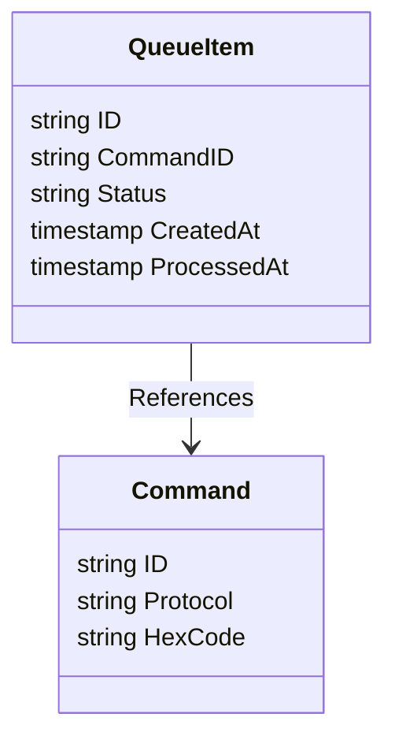
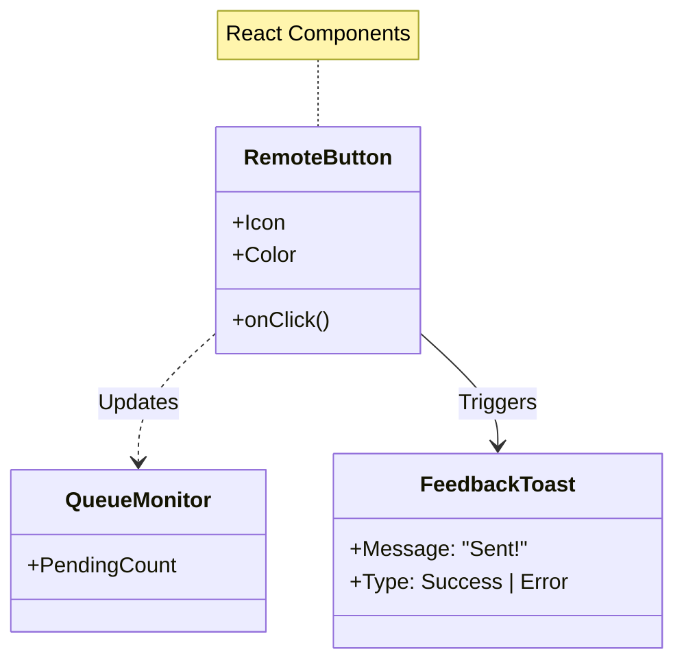
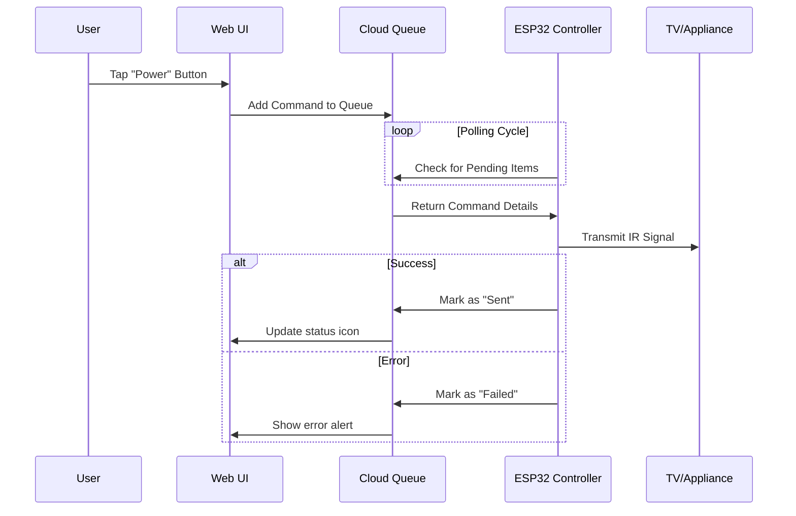

# Plan: IR Transmission

**Goal:** reliable, low-latency control of physical devices via the Web Interface.

## Functional Requirements

1.  **Queue-Based Execution**: Commands sent from the web should be queued to ensure none are lost if the device is momentarily offline.
2.  **Latency Targets**: The time from "Button Press" on a phone to "IR Signal Emission" should be under 500ms for a responsive feel.
3.  **State Tracking**: The user should see the status of a command ("Pending" -> "Sent" or "Failed").
4.  **Security**: The ESP32 must authenticate securely before reading commands to prevent unauthorized control.

## Data Model

### Frontend Architecture

## System Workflow

## Technical Strategy

-   **Command Queue Pattern**: We will use a First-In-First-Out (FIFO) queue structure in the database. This decouples the web app from the physical device, allowing for better error handling and retry logic.
-   **Polling vs Streaming**: To balance device stability with responsiveness, we will use a "Fast Poll" mechanism or an optimized persistent stream connection from the ESP32 to the Cloud.
-   **Protocol Support**: The transmitter will support dynamic protocol switching (swapping between NEC, Sony, etc.) based on the metadata stored during the Learning phase.

## Verification

-   **Latency Measurement**: Automated logging to measure round-trip time.
-   **Stress Test**: Rapidly firing 10 commands to ensure they are executed in the correct order without dropping any.
-   **Range Test**: Verify the IR emitter strength is sufficient to control devices from across the room.
