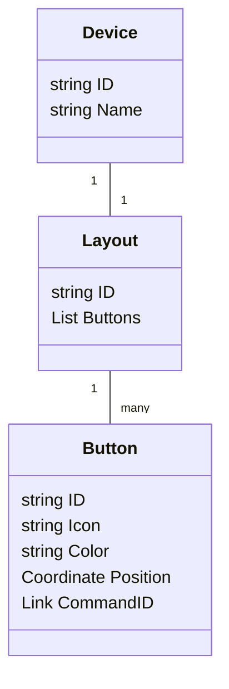
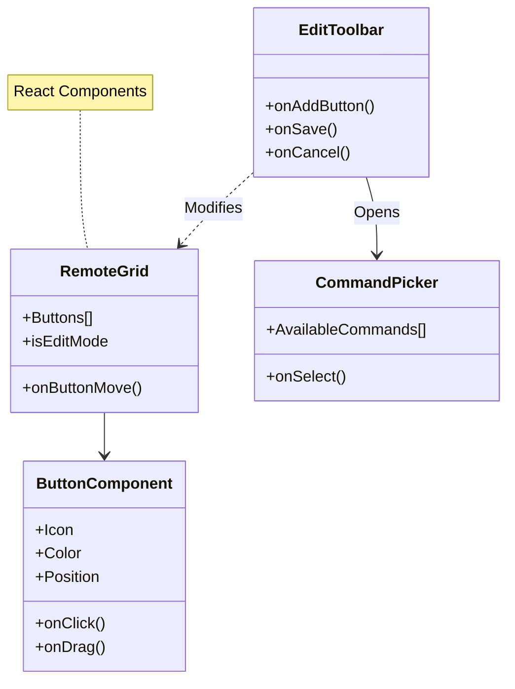
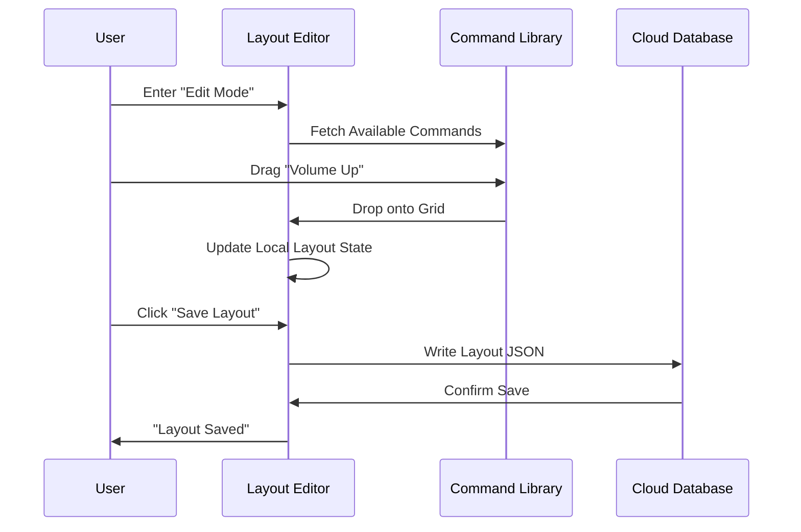

# Plan: Virtual Remote Designer

**Goal:** A flexible, user-friendly interface that allows users to create custom remote layouts that map to their physical devices.

## Functional Requirements

1.  **Custom Layouts**: Users should not be restricted to a generic grid; they should be able to arrange buttons to match their preference (e.g., D-Pad on the left, Volume on the right).
2.  **Device Management**: Users can create multiple "Virtual Remotes" (e.g., "Living Room TV", "Bedroom AC").
3.  **Button Customization**: Each button can be customized with a label, an icon (e.g., Power, Volume, Mute), and a color.
4.  **Editing Mode**: A dedicated "Edit Mode" prevents accidental clicks while rearranging the interface.

## Data Model

## Frontend Architecture

## System Workflow

## Technical Strategy

-   **Responsive Grid**: The design will use a responsive grid system that adapts to mobile screens (single column) and desktop screens (multi-column/free canvas).
-   **Optimistic UI**: When a user clicks a button, the UI will immediately show a "Pressed" state before waiting for cloud confirmation, making the app feel native and snappy.
-   **Context-Aware Configuration**: The editor will only show commands available for the specific device being edited (e.g., TV commands won't show up when editing current AC remote).

## Design Principles

### Loose Coupling

- **Layout Persistence Interface (`ILayoutRepository`)**: Defines `save(layout)` and `load(deviceId)`. Decouples React components from Firestore.
- **Command Service Interface (`ICommandService`)**: `getAvailableCommands(deviceId)` abstracts how commands are fetched. Components don't know about REST vs GraphQL vs real-time subscriptions.
- **Drag-and-Drop Abstraction**: Wrap drag library (react-dnd, dnd-kit) in custom hook/adapter. Enables swapping libraries without rewriting components.

### TDD Approach (Limited Applicability)

**Unit Tests (write first):**
- Test layout validation logic (no overlapping buttons, positions within grid bounds)
- Test serialization/deserialization of layout JSON
- Test command filtering by device type

**Snapshot Tests:**
- Verify ButtonComponent renders correctly for various icon/color combinations

**Integration Tests:**
- Test save/load round-trip with mock repository

### Why TDD is Limited Here

This feature is **heavily UI-focused**. Core behaviors like drag-and-drop, visual responsiveness, and "feel" are difficult to test-drive because:
1. Drag interactions depend on browser APIs and user gestures
2. Layout aesthetics require visual inspection, not assertions
3. The value is in usability, which requires manual/exploratory testing

**Recommendation:** Apply TDD to the **data layer** (layout validation, persistence, command mapping) but use **manual testing and design reviews** for the interaction layer. Consider Playwright for E2E smoke tests of critical paths.

## Verification

-   **Usability Testing**: Ensure users can easily add and move buttons on a phone screen.
-   **Data Integrity**: Verify that a layout saved on desktop renders correctly on mobile.
