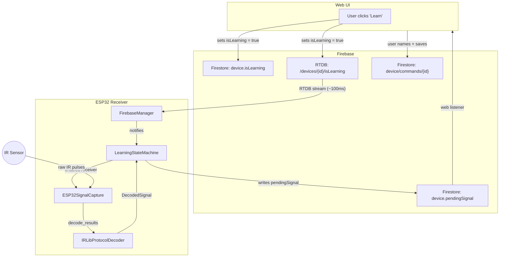

# Receiver - ESP32 Implementation

**Purpose:** Capture and decode IR signals from physical remotes.

## Architecture



### File Layout

```
include/receiver/
├── ISignalCapture.h        # Hardware abstraction for IR receiver
└── IProtocolDecoder.h      # Protocol decoding abstraction

src/receiver/
├── ESP32SignalCapture.cpp  # IRrecv wrapper
├── IRLibProtocolDecoder.cpp # Protocol decoders (NEC, Samsung, Sony)
└── LearningStateMachine.cpp # Learning mode logic
```

## Components

### ESP32SignalCapture (ISignalCapture)
Wraps the IRremoteESP8266 library receiver.

**Responsibilities:**
- Configure IR receiver pin
- Enable/disable receiver
- Check for signal availability
- Decode raw IR pulses

### IRLibProtocolDecoder (IProtocolDecoder)
Identifies and decodes known protocols.

**Supported Protocols:**
- NEC (32-bit)
- Samsung (32-bit)
- Sony (12/15/20-bit)
- Raw (fallback)

**Responsibilities:**
- Parse `decode_results` from IRrecv
- Extract protocol, address, command code
- Fall back to raw timing if unknown
- Return structured `DecodedSignal`

### LearningStateMachine
Manages learning mode state and timeouts.

**States:**
- IDLE: Normal operation (waiting for commands via RTDB)
- LEARNING: Waiting for IR signal
- CAPTURED: Signal received, uploading to Firestore
- TIMEOUT: No signal after 30 seconds

**Responsibilities:**
- React to Firestore `device.isLearning` changes (delivered via streaming)
- Transition to LEARNING state
- Capture one signal
- Upload to Firestore via Firebase ESP32 SDK
- Return to IDLE

## Testing Strategy

### Native Unit Tests (Fast TDD)
Tests run on your desktop machine (~1 second) using mock Arduino types.

**Run tests:**
```bash
pio test -e native_test
```

**Test structure:**
```cpp
// test/test_protocol_decoder/test_nec_decoder.cpp
test_nec_protocol_decodes_tv_power()
test_nec_protocol_decodes_samsung_tv_volume_up()
test_unknown_protocol_returns_raw()
```

**How it works:**
- `NATIVE_BUILD` flag enables conditional compilation
- `test/mock_arduino.h` provides mock types for `decode_results`, protocol constants
- Tests compile and run natively without ESP32 hardware

### Hardware Integration Tests
Use `platformio.ini` environment `ir_receiver_test`:
```bash
pio run -e ir_receiver_test --target upload
```

See `src/hardware_tests/ir_receiver_test.cpp` for validation script.

This verifies real IR signal capture with physical hardware.

## Dependencies

- `IRremoteESP8266` - IR signal capture and decoding
- `Firebase-ESP-Client` - Firestore integration
- `Adafruit_NeoPixel` - Status LED

## Integration

The receiver integrates with the **Learning** web feature. The web UI triggers learning mode via Firestore + RTDB, the ESP32 captures and decodes the IR signal, then writes a `pendingSignal` back to Firestore for the web to display.
