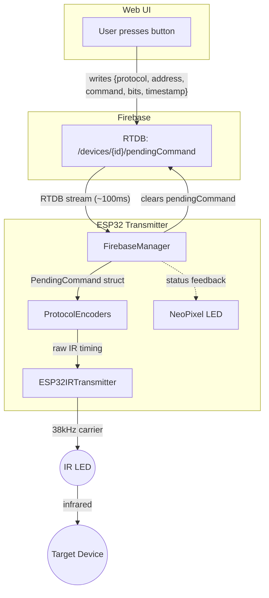

# Transmitter - ESP32 Implementation

**Purpose:** Receive commands via RTDB and emit IR signals.

## Architecture



### File Layout

```
include/transmitter/
└── IIRTransmitter.h         # Hardware abstraction for IR transmitter

src/transmitter/
├── ESP32IRTransmitter.cpp   # IRsend wrapper
└── ProtocolEncoders.cpp     # Encode protocols to IR timing
```

## Components

### ESP32IRTransmitter (IIRTransmitter)
Wraps the IRremoteESP8266 library transmitter.

**Responsibilities:**
- Configure IR transmitter pin
- Set carrier frequency (38kHz standard)
- Transmit raw timing arrays
- Transmit encoded protocol signals

### ProtocolEncoders
Mirror of decoder functionality - converts command data to IR timing.

**Supported Protocols:**
- NEC encoder
- Samsung encoder  
- Sony encoder
- Raw playback (direct timing array)

**Responsibilities:**
- Convert (protocol, address, commandCode) → raw timing
- Generate correct carrier frequency pulses
- Validate encoding matches decoder output (symmetry tests)

### Command Dispatch (via RTDB stream)
The ESP32 receives commands directly via the RTDB stream on `/devices/{deviceId}/pendingCommand`.

**Flow:**
1. Web UI writes `pendingCommand` object to RTDB: `{protocol, address, command, bits, timestamp}`
2. RTDB stream callback fires in `FirebaseManager`
3. `FirebaseManager` extracts command fields and invokes the transmit callback
4. `main.cpp` encodes and transmits IR via `ProtocolEncoders` + `ESP32IRTransmitter`
5. ESP32 clears `pendingCommand` from RTDB after transmission

**Advantages of direct RTDB dispatch:**
- ~100ms latency (same as `isLearning` toggle)
- No Firestore reads from ESP32 for command dispatch
- Dramatically simpler code path

## Testing Strategy

### Unit Tests (TDD)
```cpp
// test/test_protocol_encoder/
test_nec_encoder_produces_correct_timing()
test_samsung_encoder_produces_correct_timing()
test_sony_encoder_produces_correct_timing()
test_encoder_decoder_symmetry()  // encode → decode → same result
```

### Hardware Tests
Use `platformio.ini` environment `ir_transmitter_test`:
```bash
pio run -e ir_transmitter_test --target upload
```

Validation: Point at TV and verify it responds to transmitted signals.

## Dependencies

- `IRremoteESP8266` - IR signal transmission
- `Firebase-ESP-Client` - RTDB streaming

## Performance Targets

- **Latency:** ~100ms from button press to IR emission (RTDB streaming)
- **Communication:** RTDB real-time streaming (SSE) — no polling, no Firestore reads
- **Range:** Sufficient for across-room control

## NeoPixel LED Feedback

The built-in NeoPixel RGB LED provides visual feedback during transmission:

| Color | Meaning |
|-------|---------|
| Purple | Processing command (received from web app) |
| Cyan-green | Transmit success (flashes 500ms) |
| Red-orange | Transmit failed (flashes 1s) |
| Dim green | Returns to ready state after flash |

Feedback is delivered via callback from `FirebaseManager` command handler to `main.cpp`.

## Integration

The transmitter integrates with the **Remote** web feature. The web UI writes a `pendingCommand` object to RTDB, the ESP32 picks it up via its RTDB stream, encodes the IR signal, and transmits it. The ESP32 clears the `pendingCommand` after transmission.
