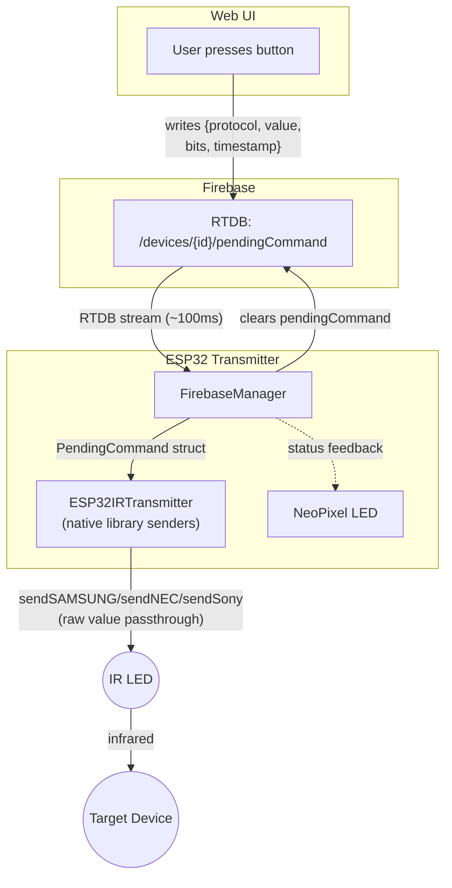

# Transmitter - ESP32 Implementation

**Purpose:** Receive commands via RTDB and emit IR signals.

## Architecture



### File Layout

```
include/transmitter/
└── IIRTransmitter.h         # Hardware abstraction for IR transmitter

src/transmitter/
├── ESP32IRTransmitter.cpp   # IRsend wrapper
└── ProtocolEncoders.cpp     # Encode protocols to IR timing
```

## Components

### ESP32IRTransmitter (IIRTransmitter)
Wraps the IRremoteESP8266 library transmitter.

**Responsibilities:**
- Configure IR transmitter pin
- Set carrier frequency (38kHz standard)
- Transmit raw timing arrays
- Transmit encoded protocol signals

### Command Dispatch (via RTDB stream)
The ESP32 receives commands directly via the RTDB stream on `/devices/{deviceId}/pendingCommand`.

**Flow:**
1. Web UI writes `pendingCommand` object to RTDB: `{protocol, value, bits, timestamp}`
2. RTDB stream callback fires in `FirebaseManager`
3. `FirebaseManager` extracts `protocol`, `value`, and `bits`; invokes the transmit callback
4. `main.cpp` dispatches to the library's native sender based on protocol:
   - `SAMSUNG` → `irTransmitter.transmitSamsung(value, bits)`
   - `NEC` → `irTransmitter.transmitNEC(value, bits)`
   - `SONY` → `irTransmitter.transmitSony(value, bits)`
5. ESP32 clears `pendingCommand` from RTDB after transmission

**Why native senders instead of custom ProtocolEncoders:**
- The decoder's `address`/`command` fields are bit-reversed 8-bit extractions — reconstructing the raw data from them is error-prone
- The raw `value` from the decoder IS the exact data the native sender needs
- Native senders have hardware-level timing accuracy built into the library
- Eliminates the custom encoder as a failure point in the transmit path

**Advantages of direct RTDB dispatch:**
- ~100ms latency (same as `isLearning` toggle)
- No Firestore reads from ESP32 for command dispatch
- Dramatically simpler code path

### ProtocolEncoders (retained for testing)
Custom encoders that convert (protocol, address, command) → raw IR timing.
Retained for native unit tests (encode→decode symmetry) but **not used in the production transmit path**.
The production path uses the library's native senders with raw `value` passthrough.

## Testing Strategy

### Unit Tests (TDD)
```cpp
// test/test_protocol_encoder/
test_nec_encoder_produces_correct_timing()
test_samsung_encoder_produces_correct_timing()
test_sony_encoder_produces_correct_timing()
test_encoder_decoder_symmetry()  // encode → decode → same result
```

### Hardware Tests

**Native sender test** (`ir_native_samsung_test`):
```bash
pio run -e ir_native_samsung_test --target upload
```
Sends a known Samsung command using the library's `sendSAMSUNG()` directly.
Validation: Point at TV and verify it responds.

**Custom encoder test** (`ir_transmitter_test`):
```bash
pio run -e ir_transmitter_test --target upload
```
Uses our custom `ProtocolEncoders` → raw transmit path.
Useful for encoder regression testing.

## Dependencies

- `IRremoteESP8266` - IR signal transmission
- `Firebase-ESP-Client` - RTDB streaming

## Performance Targets

- **Latency:** ~100ms from button press to IR emission (RTDB streaming)
- **Communication:** RTDB real-time streaming (SSE) — no polling, no Firestore reads
- **Range:** Sufficient for across-room control

## NeoPixel LED Feedback

The built-in NeoPixel RGB LED provides visual feedback during transmission:

| Color | Meaning |
|-------|---------|
| Purple | Processing command (received from web app) |
| Cyan-green | Transmit success (flashes 500ms) |
| Red-orange | Transmit failed (flashes 1s) |
| Dim green | Returns to ready state after flash |

Feedback is delivered via callback from `FirebaseManager` command handler to `main.cpp`.

## Data Model

### RTDB pendingCommand
```json
{
  "protocol": "SAMSUNG",
  "value": 1085341727,
  "bits": 32,
  "timestamp": 1707350400000
}
```

`value` is the raw decoder output (`results->value`) — the exact integer the library's native sender needs. `address` and `command` are NOT sent; they are only stored in Firestore for display purposes.

### Firestore IRCommand (web)
```
devices/{deviceId}/commands/{commandId}
  - name: string
  - protocol: string
  - address: string      (display only — decoded/reversed)
  - command: string      (display only — decoded/reversed)
  - value: string        (raw decoder output — used for transmission)
  - bits: number
  - capturedAt: timestamp
```

## Integration

The transmitter integrates with the **Remote** web feature. The web UI reads `value` and `bits` from the Firestore command document, writes them as a `pendingCommand` to RTDB, the ESP32 picks it up via its RTDB stream, and passes the raw value directly to the library's native sender. The ESP32 clears the `pendingCommand` after transmission.
