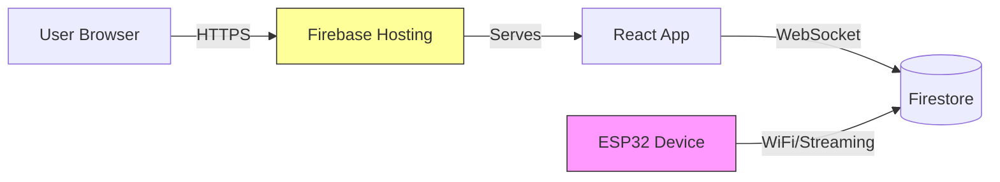

# Pulsr Web App - Architecture

## Tech Stack

### Core Framework
- **React 18** - UI library
- **TypeScript** - Type safety (`strict: true`)
- **Vite** - Build tool and dev server
- **React Router v6** - Client-side routing

### UI & Styling
- **TailwindCSS** - Utility-first CSS
- **shadcn/ui** - Accessible component primitives (copy-paste, not npm)
- **Lucide React** - Icon library
- **Radix UI** - Unstyled accessible components (via shadcn/ui)

### Backend & Data
- **Firebase Hosting** - Static site deployment
- **Firestore** - Real-time database
- **Firebase Auth** - Authentication (if needed)
- **Firebase Cloud Functions** - Serverless backend (chatbot only)

### Testing
- **Vitest** - Unit test runner
- **React Testing Library** - Component testing
- **Playwright** - E2E testing
- **MSW (Mock Service Worker)** - API mocking for integration tests

### Development Tools
- **ESLint** - Linting
- **Prettier** - Code formatting
- **Husky** - Git hooks (optional)

## Design Patterns

### Repository Pattern

All Firebase interactions go through repository interfaces for testability:

```typescript
interface ICommandRepository {
  getCommands(deviceId: string): Promise<Command[]>
  addCommand(command: Command): Promise<void>
  deleteCommand(id: string): Promise<void>
  listenToCommands(
    deviceId: string, 
    callback: (commands: Command[]) => void
  ): () => void
}

// Production implementation
class FirestoreCommandRepository implements ICommandRepository {
  async getCommands(deviceId: string) {
    const snapshot = await getDocs(
      collection(db, `devices/${deviceId}/commands`)
    )
    return snapshot.docs.map(doc => ({ id: doc.id, ...doc.data() }))
  }
  // ...
}

// Test implementation
class InMemoryCommandRepository implements ICommandRepository {
  private commands: Map<string, Command[]> = new Map()
  
  async getCommands(deviceId: string) {
    return this.commands.get(deviceId) || []
  }
  // ...
}
```

### Custom Hooks

Repositories are exposed via React hooks:

```typescript
// Hook wraps repository
function useCommands(deviceId: string) {
  const [commands, setCommands] = useState<Command[]>([])
  const [loading, setLoading] = useState(true)
  const repo = useCommandRepository() // Injected via context
  
  useEffect(() => {
    setLoading(true)
    return repo.listenToCommands(deviceId, (cmds) => {
      setCommands(cmds)
      setLoading(false)
    })
  }, [deviceId, repo])
  
  const addCommand = useCallback(
    (command: Command) => repo.addCommand(command),
    [repo]
  )
  
  return { commands, loading, addCommand }
}
```

### Dependency Injection

Repositories are provided via React Context:

```typescript
// Context for swapping implementations
const CommandRepositoryContext = createContext<ICommandRepository>(
  new FirestoreCommandRepository()
)

// In tests
<CommandRepositoryContext.Provider value={new InMemoryCommandRepository()}>
  <YourComponent />
</CommandRepositoryContext.Provider>
```

## ESP32 Communication Model

**The ESP32 does NOT serve the web application.**



**Data Flow:**

1. User opens app → Firebase Hosting serves React app
2. User triggers learning mode → React writes to `devices/{id}.isLearning = true`
3. ESP32 streams device document → Instantly detects `isLearning = true`
4. ESP32 captures IR signal → Writes to `devices/{id}/commands/{commandId}`
5. React listens to Firestore → Real-time update shows new command

**No direct ESP32 ↔ Web communication.** Both the web app (via Firestore SDK `onSnapshot`) and the ESP32 (via Firestore REST streaming / SSE) use real-time listeners instead of polling.

## Project Structure

```
web/
├── src/
│   ├── features/
│   │   ├── learning/
│   │   │   ├── components/
│   │   │   │   ├── LearningModal.tsx
│   │   │   │   ├── CommandList.tsx
│   │   │   │   └── DeviceSelector.tsx
│   │   │   ├── hooks/
│   │   │   │   ├── useCommands.ts
│   │   │   │   ├── useLearningMode.ts
│   │   │   │   └── useDevices.ts
│   │   │   ├── repositories/
│   │   │   │   ├── ICommandRepository.ts
│   │   │   │   ├── FirestoreCommandRepository.ts
│   │   │   │   └── InMemoryCommandRepository.ts
│   │   │   ├── types/
│   │   │   │   └── index.ts
│   │   │   └── __tests__/
│   │   │       ├── LearningModal.test.tsx
│   │   │       └── useCommands.test.ts
│   │   ├── remote/
│   │   │   ├── components/
│   │   │   ├── hooks/
│   │   │   ├── repositories/
│   │   │   └── __tests__/
│   │   ├── designer/
│   │   │   ├── components/
│   │   │   ├── hooks/
│   │   │   ├── repositories/
│   │   │   └── __tests__/
│   │   ├── chatbot/
│   │   │   ├── components/
│   │   │   ├── hooks/
│   │   │   └── __tests__/
│   │   └── core/
│   │       ├── firebase/
│   │       │   ├── config.ts
│   │       │   └── auth.ts
│   │       ├── ui/
│   │       │   ├── button.tsx          # shadcn/ui components
│   │       │   ├── dialog.tsx
│   │       │   ├── input.tsx
│   │       │   └── ...
│   │       ├── navigation/
│   │       │   ├── AppShell.tsx
│   │       │   ├── Sidebar.tsx
│   │       │   └── BottomNav.tsx
│   │       └── types/
│   │           └── index.ts            # Shared types
│   ├── App.tsx
│   ├── main.tsx
│   └── router.tsx
├── public/
├── tests/
│   ├── e2e/                            # Playwright tests
│   └── setup.ts
├── package.json
├── tsconfig.json
├── vite.config.ts
├── tailwind.config.js
├── components.json                      # shadcn/ui config
└── playwright.config.ts
```

## Routing Structure

```typescript
// router.tsx
const router = createBrowserRouter([
  {
    path: '/',
    element: <AppShell />,
    children: [
      { index: true, element: <RemoteView /> },              // Remote
      { path: 'devices', element: <DeviceList /> },          // Designer
      { path: 'designer/:id', element: <LayoutEditor /> },   // Designer
      { path: 'designer/:id/learn', element: <LearningModal /> }, // Learning
    ],
  },
])
```

Navigation:
- Bottom tab bar on mobile
- Sidebar on desktop
- Floating chat widget on all pages

## Development Workflow

### 1. Mock-First Development

Build features with mock repositories before ESP32 is ready:

```typescript
// During development
const mockRepo = new InMemoryCommandRepository()
mockRepo.addCommand({ 
  id: '1', 
  name: 'Power', 
  protocol: 'NEC',
  address: '0x04',
  command: '0x08'
})

<CommandRepositoryContext.Provider value={mockRepo}>
  <App />
</CommandRepositoryContext.Provider>
```

### 2. TDD Workflow

1. Write failing test
2. Implement minimal code
3. Refactor while keeping tests green
4. Repeat

**Focus TDD on:**
- Repository interfaces
- Custom hooks
- Business logic (validation, state machines)

**Use manual/E2E testing for:**
- Drag-and-drop UX
- Visual design
- Animations

### 3. Testing Strategy

```typescript
// Unit test - Hook behavior
describe('useCommands', () => {
  it('loads commands on mount', async () => {
    const mockRepo = new InMemoryCommandRepository()
    const { result } = renderHook(() => useCommands('device-1'), {
      wrapper: createWrapper(mockRepo)
    })
    
    await waitFor(() => expect(result.current.loading).toBe(false))
    expect(result.current.commands).toHaveLength(0)
  })
})

// Component test - UI interactions
describe('LearningModal', () => {
  it('shows waiting state when learning mode active', () => {
    render(<LearningModal deviceId="device-1" isOpen />)
    expect(screen.getByText(/point remote at device/i)).toBeInTheDocument()
  })
})

// E2E test - Full workflow
test('user can learn a new command', async ({ page }) => {
  await page.goto('/designer/device-1/learn')
  await page.click('button:has-text("Start Learning")')
  await page.waitForSelector('text=Waiting for signal...')
  // ESP32 would write command to Firestore here
  await page.waitForSelector('text=Command captured!')
  await page.fill('input[name="commandName"]', 'Volume Up')
  await page.click('button:has-text("Save")')
  await expect(page.locator('text=Volume Up')).toBeVisible()
})
```

## Deployment

```bash
# Build production bundle
npm run build

# Deploy to Firebase Hosting
firebase deploy --only hosting
```

**Build output:** `dist/` directory with static assets

**Firebase Hosting serves:**
- `/index.html` - Main app
- `/assets/*` - JS/CSS bundles
- All routes redirect to `/index.html` (SPA)

## Security Considerations

### Firestore Security Rules

```javascript
rules_version = '2';
service cloud.firestore {
  match /databases/{database}/documents {
    // Only authenticated users can access
    match /devices/{deviceId} {
      allow read: if request.auth != null;
      allow write: if request.auth != null && request.auth.uid == resource.data.ownerId;
      
      match /commands/{commandId} {
        allow read: if request.auth != null;
        allow write: if request.auth != null;
      }
      
      match /queue/{queueId} {
        allow read: if request.auth != null;
        allow create: if request.auth != null;
      }
    }
  }
}
```

### API Keys

- Firebase config (public API keys) are safe to commit
- Cloud Function secrets stored in Firebase environment
- Never commit actual service account keys

## Performance Optimizations

1. **Code Splitting** - Route-based lazy loading
   ```typescript
   const LayoutEditor = lazy(() => import('./features/designer/LayoutEditor'))
   ```

2. **Firestore Queries** - Index and limit results
   ```typescript
   query(
     collection(db, 'commands'),
     where('deviceId', '==', deviceId),
     orderBy('createdAt', 'desc'),
     limit(50)
   )
   ```

3. **Real-time Listener Cleanup**
   ```typescript
   useEffect(() => {
     const unsubscribe = onSnapshot(docRef, callback)
     return unsubscribe // Cleanup on unmount
   }, [])
   ```

4. **Optimistic Updates**
   ```typescript
   // Show button as "pressed" immediately
   setButtonState('pressed')
   await queueCommand(commandId)
   ```

## Development Phases

### Phase 1: Foundation (Week 1)
- [ ] Vite + React + TypeScript setup
- [ ] TailwindCSS + shadcn/ui installation
- [ ] Firebase SDK integration
- [ ] Router setup with AppShell
- [ ] Repository interfaces defined

### Phase 2: Learning UI (Week 2)
- [ ] Mock repositories
- [ ] LearningModal component
- [ ] CommandList component
- [ ] Unit tests for state logic
- [ ] E2E test with Playwright

### Phase 3: Designer UI (Week 3)
- [ ] LayoutEditor with drag-and-drop
- [ ] ButtonConfigModal
- [ ] CommandPicker
- [ ] Layout validation logic (TDD)

### Phase 4: Remote UI (Week 4)
- [ ] RemoteButton component
- [ ] RemoteGrid layout
- [ ] QueueMonitor
- [ ] Real-time status updates

### Phase 5: Chatbot UI (Week 5)
- [ ] ChatWidget component
- [ ] Cloud Function setup
- [ ] AI provider integration
- [ ] Knowledge base RAG

### Phase 6: Integration (Week 6)
- [ ] Replace mock repositories with Firestore
- [ ] Integration testing
- [ ] E2E test suite
- [ ] Performance optimization
- [ ] Firebase deployment
