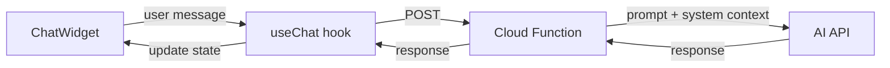

# Chatbot — v1 Plan

**Purpose:** Floating chat widget that lets users ask an AI about Pulsr setup and troubleshooting.

## How It Works

```
User types message → Cloud Function → AI API → response displayed in chat
```

1. User clicks floating chat button (bottom-right corner)
2. Chat panel opens, user types a question
3. Message is sent to a Firebase Cloud Function
4. Cloud Function forwards the message to an AI API with a Pulsr-specific system prompt
5. AI response is streamed/returned and displayed in the chat panel

Messages are kept in local React state for the current session. No persistence needed for v1.

## Architecture



## Frontend (Web)

- **ChatWidget** — floating button + expandable chat panel
- **useChat hook** — manages messages array, loading state, sends to Cloud Function
- **IChatRepository** — interface for the Cloud Function call (+ mock for dev/testing)

File structure follows existing patterns:
```
features/chatbot/
├── components/ChatWidget.tsx
├── hooks/useChat.ts
├── repositories/IChatRepository.ts, CloudFunctionChatRepository.ts, MockChatRepository.ts
└── types/index.ts
```

## Backend (Cloud Function)

A single Firebase Cloud Function that:
1. Receives `{ message, history }` from the frontend
2. Builds a prompt with a Pulsr system message + conversation history
3. Calls the AI API (pick one: OpenAI or Anthropic)
4. Returns `{ response }` to the frontend

API key is stored in Cloud Function environment config — never exposed to the client.

```
functions/
├── src/
│   ├── index.ts          # exports the chat function
│   └── chat.ts           # prompt construction + AI API call
├── package.json
└── .env                   # API key (not committed)
```

## What's NOT in v1

These are real features but can be added later once v1 works:
- **RAG / knowledge base** — just use a good system prompt for now
- **Session persistence** — local state is fine; add Firestore later if needed
- **Multiple AI providers** — pick one, add abstraction later if you switch
- **Rate limiting / auth** — add when the app has real users
- **Streaming responses** — nice UX improvement, not essential for v1

## Testing

- **Unit**: useChat hook with MockChatRepository
- **Component**: ChatWidget renders, sends messages, shows loading
- **E2E** (Playwright): open chat → type message → see response
